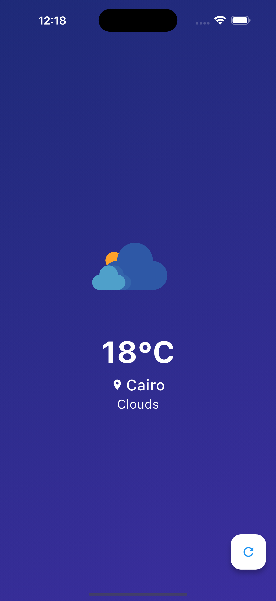

# 🌦️ WeatherApp

<p align="center">
  
</p>

<p align="center" style="display: flex; gap: 10px;">

</p>

## 🌟 Overview

**WeatherApp** is a modern flutter application for 1-day forecast :


## 🌦️ Weather Functionality
- Current weather conditions display
- 1-day forecast
- Weather condition animations

## Installation

1. Clone the repository:
    ```bash
    git clone https://github.com/AbdelrahmanElKhodary114/Weather-App-Flutter.git
    ```
2. Open the projec.
3. Build and run the application.

## Contributing

Feel free to open issues or submit pull requests. Please ensure your code adheres to the project's coding standards and includes appropriate tests.
